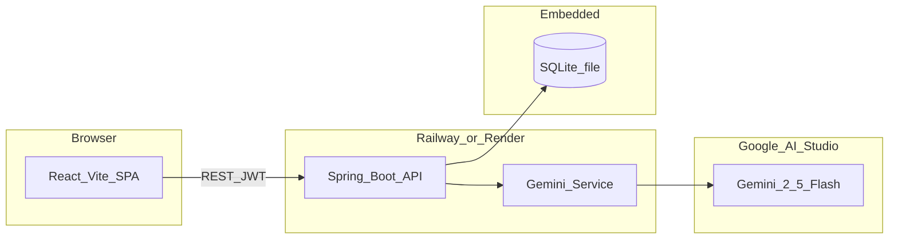
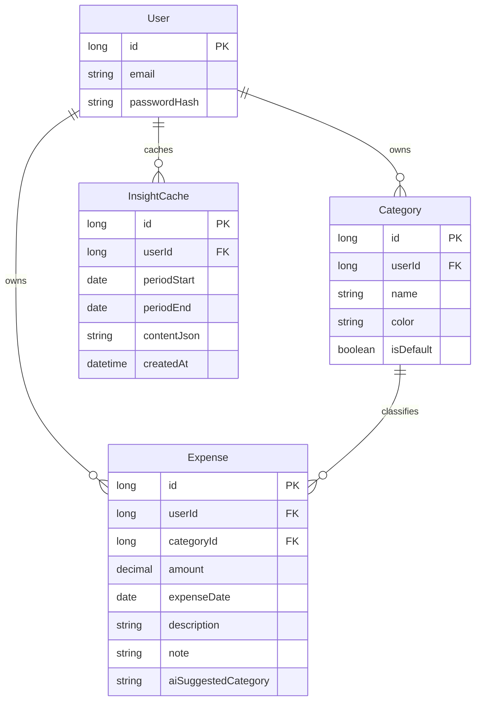
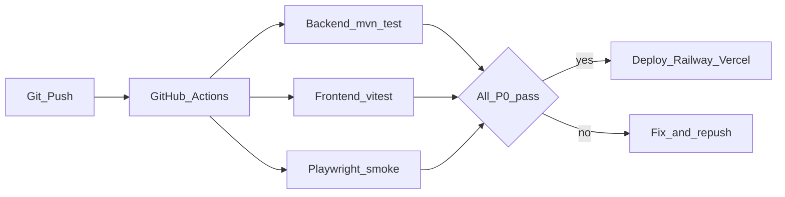
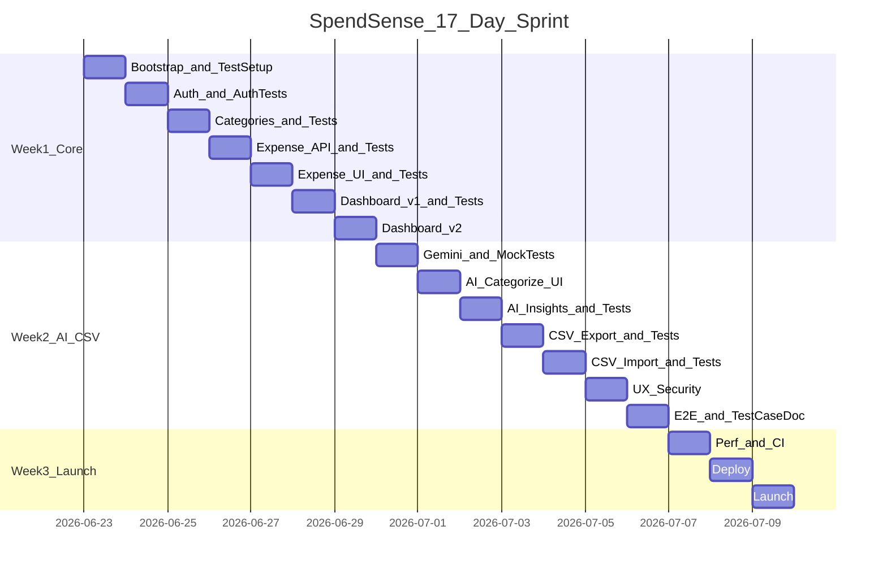

# SpendSense – Personal Expense Tracker with AI Insights

## Goal

Ship **SpendSense** — a **web app** (desktop + mobile browser) where users log expenses, view an **interactive dashboard**, import/export CSV, and get **Gemini-powered AI insights**. Target: usable MVP in **17 days** as a solo developer.

---

## Tech Stack

| Layer | Choice | Why |
|-------|--------|-----|
| **Backend** | [Spring Boot 3.x](https://spring.io/projects/spring-boot) (Java 21) | REST API, security, CSV, AI — your preferred stack |
| **Database** | **SQLite** (embedded file) | Zero cloud DB setup; fine for MVP/single-instance |
| **ORM** | Spring Data JPA + Hibernate | Standard Spring persistence |
| **Migrations** | Flyway | Versioned schema in `db/migration/` |
| **Auth** | Spring Security + **JWT** | Stateless API auth for React SPA |
| **AI** | [Spring AI](https://docs.spring.io/spring-ai/reference/) + **Google Gemini** (`gemini-2.5-flash`) | Free dev tier (~1,500 req/day); no local install |
| **Frontend** | **React 18 + Vite + TypeScript** | Clean pairing with Spring REST API (your choice) |
| **Routing** | React Router v6 | Dashboard, expenses, categories pages |
| **CSS** | **Tailwind CSS + shadcn/ui** | Polished, responsive components |
| **Data fetching** | TanStack Query (React Query) | Caching, refetch on filter change |
| **Charts** | Recharts | Interactive pie/bar charts |
| **Forms** | React Hook Form + Zod | Client validation matching API DTOs |
| **CSV** | Apache Commons CSV (backend) | Import/export endpoints |
| **API docs** | Springdoc OpenAPI (optional) | Swagger UI for dev/testing |
| **Backend tests** | JUnit 5, Mockito, Spring Boot Test, MockMvc | Unit + integration + API tests |
| **Frontend tests** | Vitest, React Testing Library, MSW | Component + hook tests with mocked API |
| **E2E tests** | Playwright (light) | 5–8 critical user-flow smoke tests |
| **Test docs** | `docs/test-cases.md` | Manual + automated test case catalog |
| **CI** | GitHub Actions | Run backend + frontend tests on every push |
| **Deploy** | Backend: **Railway** or **Render**; Frontend: **Vercel** or **Netlify** | Deploy blocked if tests fail |



**Defer post-MVP:** Plaid bank sync, receipt OCR, multi-currency, budgets/alerts, recurring expenses.

---

## Repository Layout

Two-folder monorepo (simplest for MVP):

```
spendsense/
  backend/
    src/main/java/.../
    src/test/java/.../          # Unit + integration tests
      controller/               # MockMvc API tests
      service/                  # Service unit tests
      repository/               # @DataJpaTest
    src/test/resources/
      application-test.yml      # In-memory SQLite, mock AI
      test-data/                # Sample CSV files
  frontend/
    src/
    src/**/*.test.tsx           # Vitest component tests
    src/test/setup.ts           # RTL + MSW setup
  docs/
    test-cases.md               # Test case catalog (manual + auto)
  .github/workflows/ci.yml      # Run tests on push
```

---

## MVP Features (17-day scope)

### Must-have

1. **JWT auth** — Register, login, logout; protected routes on frontend + backend
2. **Manual expense CRUD** — Amount, date, description, category, optional note
3. **Categories** — 8–10 defaults seeded on register + custom category CRUD
4. **Expense list** — Filter/sort by date range and category; edit/delete
5. **Interactive dashboard** — Summary cards, category pie chart, spend-over-time bar chart, date range picker (refetch on change)
6. **AI categorization** — Gemini suggests category from description; user confirms before save
7. **AI insights** — "Generate insights" for selected period (summary, top categories, 2–3 tips)
8. **CSV export** — Download expenses for date range
9. **CSV import** — Upload file, validate rows, bulk insert with error report
10. **Responsive UI** — Mobile-friendly forms and dashboard
11. **Automated tests** — Backend unit/integration/API tests; frontend component tests; E2E smoke tests
12. **Test case documentation** — `docs/test-cases.md` covering all MVP features (manual + automated)

### Cut for MVP

| Defer | Reason |
|-------|--------|
| Bank sync (Plaid) | 1–2 weeks alone |
| Receipt OCR | File upload + vision complexity |
| Budgets & alerts | Not core to track + insights |
| OAuth social login | Email/password JWT is faster; add Google later |
| Dark mode | Stretch only |

---

## Data Model



**SQLite indexes:** `(user_id, expense_date)`, `(user_id, category_id)`.

---

## Key REST API Endpoints

| Method | Endpoint | Purpose |
|--------|----------|---------|
| POST | `/api/auth/register` | Create user |
| POST | `/api/auth/login` | Return JWT |
| GET | `/api/categories` | List user categories |
| POST/PUT/DELETE | `/api/categories/{id}` | Category CRUD |
| GET | `/api/expenses` | List with `from`, `to`, `categoryId`, `page` |
| POST/PUT/DELETE | `/api/expenses/{id}` | Expense CRUD |
| GET | `/api/dashboard/summary` | Totals, byCategory, byDay for charts |
| POST | `/api/ai/categorize` | `{ description }` → suggested category |
| POST | `/api/ai/insights` | `{ from, to }` → insights JSON (cached 24h) |
| GET | `/api/expenses/export` | CSV download |
| POST | `/api/expenses/import` | Multipart CSV upload |

All endpoints (except auth) require `Authorization: Bearer <jwt>` and scope data by authenticated `userId`.

---

## Spring Boot Configuration Highlights

**SQLite + JPA** (`application.yml`):
```yaml
spring:
  datasource:
    url: jdbc:sqlite:./data/expenses.db
    driver-class-name: org.sqlite.JDBC
  jpa:
    database-platform: org.hibernate.community.dialect.SQLiteDialect
    hibernate:
      ddl-auto: validate
  flyway:
    enabled: true

spring.ai.google.genai:
  api-key: ${GEMINI_API_KEY}
  chat:
    options:
      model: gemini-2.5-flash
```

**Profiles:**
- `dev` — Gemini live, verbose logging, CORS for `localhost:5173`
- `test` — Mock AI service, in-memory or temp SQLite
- `prod` — Gemini live, strict CORS for Vercel domain

**Dependencies (Maven):** `spring-boot-starter-web`, `spring-boot-starter-data-jpa`, `spring-boot-starter-security`, `spring-boot-starter-test`, `spring-security-test`, `spring-ai-starter-model-google-genai`, `sqlite-jdbc`, `flyway-core`, `jjwt`, `commons-csv`, `springdoc-openapi` (optional).

**Frontend devDependencies:** `vitest`, `@testing-library/react`, `@testing-library/jest-dom`, `msw`, `@playwright/test` (E2E).

---

## Testing Strategy

**Approach:** Test-as-you-build — write tests the same day each feature ships. No big-bang testing on Day 14 only.

### Test pyramid (MVP targets)

| Layer | Tool | Target | What to test |
|-------|------|--------|--------------|
| **Unit** | JUnit 5 + Mockito | ~70% of backend tests | Services, validators, CSV parser, JWT utils |
| **Integration** | Spring Boot Test + MockMvc | All REST endpoints | Auth, CRUD, dashboard, AI, CSV |
| **Repository** | `@DataJpaTest` | Key queries | User-scoped expense queries, date filters |
| **Component** | Vitest + RTL | Critical UI | Login form, ExpenseForm, InsightsCard |
| **E2E** | Playwright | 5–8 flows | Register → add expense → dashboard → insights |
| **Manual** | `docs/test-cases.md` | Full MVP checklist | UX, mobile, edge cases |

**Coverage goal (MVP):** Backend service + controller layers ≥ **70%**; frontend critical paths covered; all P0 test cases pass before deploy.

### Test environment

- **Profile:** `test` — in-memory SQLite (`jdbc:sqlite::memory:`), `MockAiService` (no Gemini calls in CI)
- **Fixtures:** `TestDataFactory` for users, categories, expenses
- **Sample files:** `backend/src/test/resources/test-data/valid-expenses.csv`, `invalid-expenses.csv`

### AI testing rule

Never call live Gemini in automated tests. Use `MockAiService` that returns fixed JSON for categorization and insights.

---

## Test Case Catalog

Document all cases in [`docs/test-cases.md`](docs/test-cases.md). Format per case:

`TC-ID | Feature | Type (Unit/Integration/E2E/Manual) | Steps | Expected Result | Automated?`

### P0 — Must pass before launch

| ID | Feature | Type | Summary |
|----|---------|------|---------|
| TC-A01 | Auth | Integration | Register with valid email/password → 201 + JWT |
| TC-A02 | Auth | Integration | Login with valid credentials → 200 + JWT |
| TC-A03 | Auth | Integration | Login with wrong password → 401 |
| TC-A04 | Auth | Integration | Access `/api/expenses` without token → 401 |
| TC-A05 | Auth | E2E | Register → redirect to dashboard |
| TC-C01 | Categories | Integration | New user gets 8–10 default categories |
| TC-C02 | Categories | Integration | Create custom category → appears in list |
| TC-C03 | Categories | Integration | Delete category not linked to expenses → success |
| TC-E01 | Expenses | Integration | Create expense with valid data → 201 |
| TC-E02 | Expenses | Integration | Create expense with amount ≤ 0 → 400 |
| TC-E03 | Expenses | Integration | User A cannot read User B's expense → 404/403 |
| TC-E04 | Expenses | Integration | Filter by date range returns correct subset |
| TC-E05 | Expenses | E2E | Add expense from UI → appears in list |
| TC-D01 | Dashboard | Integration | Summary returns correct totals and byCategory |
| TC-D02 | Dashboard | Integration | byDay aggregation matches seeded expenses |
| TC-D03 | Dashboard | E2E | Change date range → charts update |
| TC-AI01 | AI categorize | Unit | MockAiService returns category for "Uber ride" → Transport |
| TC-AI02 | AI categorize | Integration | `/api/ai/categorize` returns JSON with valid category |
| TC-AI03 | AI insights | Integration | `/api/ai/insights` returns summary + suggestions; cached on repeat |
| TC-AI04 | AI insights | E2E | Click "Generate insights" → cards render |
| TC-CSV01 | CSV export | Integration | Export returns correct headers and row count |
| TC-CSV02 | CSV import | Integration | Valid CSV → all rows imported |
| TC-CSV03 | CSV import | Integration | Invalid rows → partial import + error report |
| TC-CSV04 | CSV import | Unit | Parser rejects negative amounts and bad dates |
| TC-S01 | Security | Integration | All data queries scoped by authenticated userId |
| TC-S02 | Security | Manual | JWT secret not exposed in frontend bundle |

### P1 — Should pass (fix if time)

| ID | Feature | Type | Summary |
|----|---------|------|---------|
| TC-E06 | Expenses | Component | ExpenseForm shows validation errors on empty submit |
| TC-C04 | Categories | Component | Category color renders correctly |
| TC-D04 | Dashboard | Component | Empty state shown when no expenses |
| TC-A06 | Auth | Component | Login form shows error on 401 |
| TC-M01 | Mobile | Manual | Dashboard usable on 375px width without horizontal scroll |
| TC-P01 | Performance | Manual | Dashboard loads < 2s with 100 seeded expenses |

### P2 — Stretch

| ID | Feature | Type | Summary |
|----|---------|------|---------|
| TC-E07 | Expenses | E2E | Edit expense → changes reflected in dashboard |
| TC-CSV05 | CSV import | E2E | Upload CSV via UI → success dialog with count |

---

## Testing in CI

**GitHub Actions** (`.github/workflows/ci.yml`):

1. Backend: `./mvnw test` (or `./gradlew test`) on push/PR
2. Frontend: `npm run test` (Vitest)
3. E2E (optional on PR): `npx playwright test` against local stack
4. **Deploy gate:** Day 16 deploy only if all P0 tests green



---

## Frontend Stack Highlights

| Concern | Library |
|---------|---------|
| UI components | shadcn/ui (Button, Card, Table, Dialog, Select, DatePicker) |
| Charts | Recharts (`PieChart`, `BarChart`) with tooltips |
| API client | Axios with JWT interceptor |
| State | TanStack Query for server state; React Context for auth token |
| Routing | React Router — `/login`, `/dashboard`, `/expenses`, `/categories` |

**Interactive dashboard flow:**
1. User selects date range → TanStack Query refetches `GET /api/dashboard/summary`
2. Pie chart clicks → navigate to `/expenses?category=Food`
3. "Generate insights" → `POST /api/ai/insights` → render insight cards

**CORS (Spring):** Allow `http://localhost:5173` (dev) and production frontend URL.

---

## AI Implementation (Gemini via Spring AI)

**Categorization** (`POST /api/ai/categorize`):
- Input: description + user's category names
- Prompt: short, JSON-only response
- Output: `{ "category": "Transport", "confidence": 0.91 }`
- UX: pre-select dropdown; user confirms

**Insights** (`POST /api/ai/insights`):
- Input: aggregated totals by category (no sensitive PII)
- Output: `{ "summary", "highlights": [], "suggestions": [] }`
- Cache in `InsightCache` table keyed by `userId + period` for 24h

**Cost control:**
- Use `gemini-2.5-flash` on Google AI Studio **free tier** (no billing)
- Mock `AiService` in `test` profile
- Cap `maxOutputTokens` to ~200 for categorization, ~500 for insights
- Debounce categorization calls (300ms) on frontend

---

## CSV Import/Export

**Export:** `GET /api/expenses/export?from=&to=` → `text/csv` with columns: `date,amount,description,category,note`

**Import:** `POST /api/expenses/import` (multipart):
- Parse with Apache Commons CSV
- Validate: amount > 0, valid date, category matches existing or map to "Other"
- Return `{ imported: 42, failed: 3, errors: [...] }`
- Frontend shows result summary dialog

---

## 17-Day Sprint Calendar

**Project:** SpendSense – Personal Expense Tracker with AI Insights  
**Sprint start:** Tuesday, 23 June 2026  
**Sprint end / MVP launch:** Thursday, 9 July 2026  
**Pace:** ~6–8 focused hours per day



---

### Week 1 — Backend core + frontend shell + tests (23–29 Jun)

| Date | Day | Focus | Deliverable | Tests to create |
|------|-----|-------|-------------|-----------------|
| **Tue, 23 Jun** | 1 | Monorepo + test setup | Both apps run locally; `application-test.yml`; Vitest + JUnit configured; CI workflow skeleton | TC infra: sample passing backend + frontend smoke test |
| **Wed, 24 Jun** | 2 | Auth | JWT register/login; Spring Security; login/register UI | TC-A01–A04 integration tests; TC-A06 login component test |
| **Thu, 25 Jun** | 3 | Categories | Seed defaults; category CRUD UI | TC-C01–C03 integration; CategoryService unit tests |
| **Fri, 26 Jun** | 4 | Expense API | JPA entities; REST endpoints; validation | TC-E01–E04 integration; ExpenseService unit tests; TC-E03 isolation test |
| **Sat, 27 Jun** | 5 | Expense UI | Expense form, list, filters, edit/delete | TC-E05 E2E; TC-E06 ExpenseForm component test |
| **Sun, 28 Jun** | 6 | Dashboard v1 | Summary API; pie chart + total cards | TC-D01–D02 integration; DashboardService unit tests |
| **Mon, 29 Jun** | 7 | Dashboard v2 | Bar chart; date refetch; empty/loading states | TC-D03 E2E; TC-D04 empty-state component test |

**Week 1 milestone (29 Jun):** Core MVP working; auth, expense, category, and dashboard P0 integration tests green.

---

### Week 2 — AI, CSV, polish + tests (30 Jun – 6 Jul)

| Date | Day | Focus | Deliverable | Tests to create |
|------|-----|-------|-------------|-----------------|
| **Tue, 30 Jun** | 8 | Gemini setup | `AiService`; `MockAiService` for test profile | TC-AI01 unit; mock bean wired in `application-test.yml` |
| **Wed, 1 Jul** | 9 | AI categorize UI | Suggest category on blur; pre-fill dropdown | TC-AI02 integration test |
| **Thu, 2 Jul** | 10 | AI insights | Insights endpoint + cache; insight cards | TC-AI03 integration (cache hit); TC-AI04 E2E |
| **Fri, 3 Jul** | 11 | CSV export | Backend writer + download button | TC-CSV01 integration |
| **Sat, 4 Jul** | 12 | CSV import | Upload UI; validation; error report | TC-CSV02–04 unit + integration; sample CSV fixtures |
| **Sun, 5 Jul** | 13 | UX + security | Toasts, mobile layout, CORS, userId audit | TC-S01 security integration; TC-M01 manual mobile checklist |
| **Mon, 6 Jul** | 14 | E2E + test docs | Playwright smoke suite; complete `docs/test-cases.md`; fix failures | All P0 cases documented; E2E: register → expense → dashboard → insights |

**Week 2 milestone (6 Jul):** All P0 automated tests pass; test-case doc complete; app demo-ready locally.

---

### Week 3 — CI, deploy + launch (7–9 Jul)

| Date | Day | Focus | Deliverable | Tests to create |
|------|-----|-------|-------------|-----------------|
| **Tue, 7 Jul** | 15 | Performance + CI | SQLite indexes; pagination; CI runs full test suite on push | TC-P01 manual perf check; CI green gate enforced |
| **Wed, 8 Jul** | 16 | Deploy | Railway + Vercel; env vars; post-deploy smoke | Run P0 E2E against staging URL; TC-S02 secrets check |
| **Thu, 9 Jul** | 17 | **MVP Launch** | Production smoke test; README; SpendSense demo script | Final manual regression of P0 checklist |

**Launch day (9 Jul):** SpendSense MVP live; all P0 tests pass in CI and staging.

---

### Sprint checkpoints

| Date | Checkpoint | Success criteria |
|------|------------|------------------|
| **29 Jun** | Core MVP | Auth + expenses + dashboard; P0 integration tests for Week 1 green |
| **6 Jul** | Feature complete + tested | AI + CSV working; all P0 automated tests pass; `docs/test-cases.md` done |
| **9 Jul** | Public MVP | Deployed; CI green; staging + production smoke tests pass |

---

## Deployment Notes

| Component | Platform | Notes |
|-----------|----------|-------|
| Backend JAR | Railway or Render | Mount persistent disk for `expenses.db` |
| Frontend static | Vercel | `VITE_API_URL` points to backend |
| Secrets | Platform env vars | `GEMINI_API_KEY`, `JWT_SECRET` — never in git |
| SQLite caveat | Single instance | Fine for MVP; migrate to Postgres when scaling |

**Local dev:**
- Backend: `http://localhost:8080`
- Frontend: `http://localhost:5173`

---

## Risk Mitigation

| Risk | Mitigation |
|------|------------|
| Split-stack overhead | Strict API contract day 1; use OpenAPI/Swagger |
| Gemini rate limits (429) | Cache insights; debounce categorize; mock in tests |
| SQLite on cloud | Use persistent volume; backup `expenses.db` |
| Auth complexity | JWT only — no OAuth in MVP |
| Scope creep | No Plaid/OCR/budgets |
| Testing debt | Test-as-you-build daily; P0 cases tied to each feature day |
| Day 17 slip | Drop P2 E2E and OpenAPI first; never skip P0 integration tests |

---

## Success Metrics

- Register → first expense logged in under 2 minutes
- Dashboard refetches charts in under 1 second for 100+ expenses
- Gemini categorization ~80%+ accurate on common descriptions
- CSV import of 50 rows with clear error reporting
- Works on mobile browser without horizontal scroll
- **All 24 P0 test cases pass** in CI before deploy
- Backend service + controller test coverage ≥ **70%**
- `docs/test-cases.md` documents every MVP feature with steps and expected results

---

## Post-MVP Roadmap

1. PostgreSQL migration for multi-instance deploy
2. Google OAuth login
3. Bank sync (Plaid)
4. Budgets with alerts
5. Receipt OCR
6. PWA install prompt
