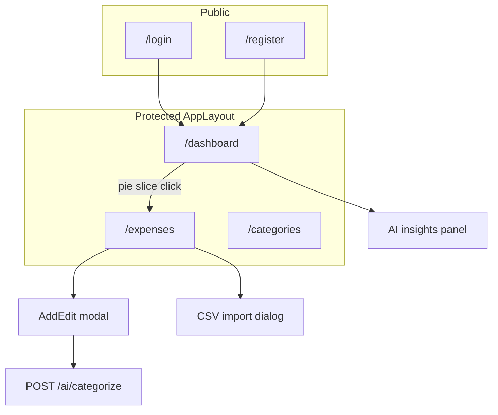
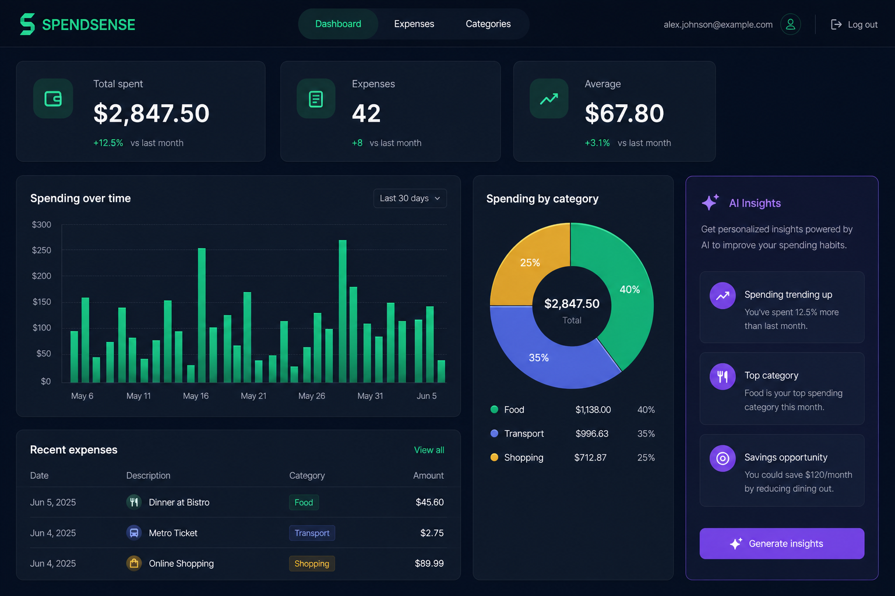
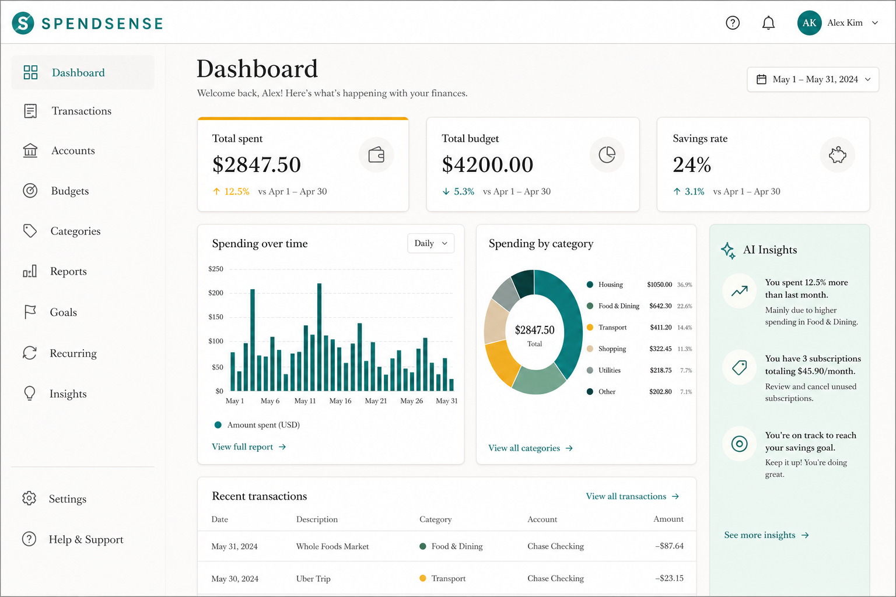
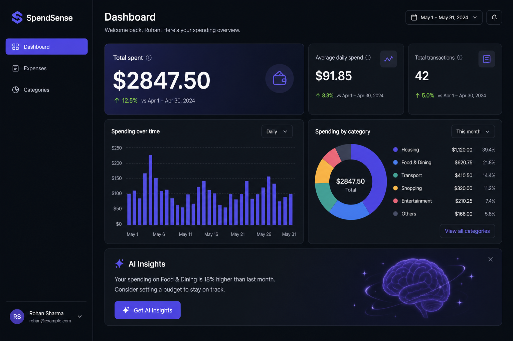

# SpendSense — Design Wireframes & Theme Specification

Design reference for the SpendSense MVP personal expense tracker. Source of truth for architecture and API scope: [expense_tracker_mvp plan](../../.cursor/plans/expense_tracker_mvp_d9134402.plan.md).

**Recommended theme:** Theme A — Midnight Ledger (implemented across frontend as of July 2026).

**Standard frames:** Desktop `1440 × 1024` · Mobile `375 × 812` · Grid **8px** · Content max-width **1200px**

---

## 1. Overview & goals

SpendSense is a web app where users log expenses, view an interactive dashboard with charts, import/export CSV, and receive Gemini-powered AI insights. This document covers:

- Three theme directions with design tokens
- PNG mockup references (Dashboard per theme)
- Figma-style frame specs (Theme A expanded for all pages)
- ASCII wireframes for every route and shared dialog
- API-to-UI mapping and implementation status

---

## 2. Page inventory

| Screen | Route / trigger | Primary APIs | Status |
|--------|-----------------|--------------|--------|
| Login | `/login` | `POST /api/auth/login` | Implemented |
| Register | `/register` | `POST /api/auth/register` | Implemented |
| Dashboard | `/dashboard` | `GET /api/dashboard/summary`, `POST /api/ai/insights` | Partial (charts yes, AI insights pending) |
| Expenses list | `/expenses` | `GET /api/expenses?from&to&categoryId&page` | Planned |
| Add/Edit expense | Modal | `POST/PUT /api/expenses`, `POST /api/ai/categorize` | Planned |
| Delete expense | Confirm dialog | `DELETE /api/expenses/{id}` | Planned |
| Categories | `/categories` | `GET/POST/PUT/DELETE /api/categories` | Implemented |
| CSV export | Button on Expenses | `GET /api/expenses/export?from&to` | Planned |
| CSV import | Dialog | `POST /api/expenses/import` (multipart) | Planned |

---

## 3. Information architecture



---

## 4. Theme comparison

| Aspect | Theme A — Midnight Ledger | Theme B — Paper & Ink | Theme C — Signal |
|--------|---------------------------|----------------------|------------------|
| Layout | Top nav + centered content | Top nav + centered content | Fixed left sidebar (240px) |
| Mode | Dark | Light | Dark |
| Primary | Emerald `#22c55e` | Teal `#0d9488` | Indigo `#6366f1` |
| KPI style | 3 equal cards | 3 equal + amber top stripe | 1 hero + 2 secondary |
| Auth page | Centered card on dark | Centered card on warm white | 50/50 split screen |
| Chart color | Emerald bars | Teal bars | Indigo bars |
| AI accent | Violet `#a78bfa` | Teal on mint panel | Indigo integrated |
| Font | Inter | Source Serif 4 + Inter | Plus Jakarta Sans |
| Best for | **MVP continuity** | Friendly, approachable | Post-MVP scale |

---

## 5. PNG mockups (Dashboard)

Visual references for each theme. Full-size files in [`mockups/`](mockups/).

| Theme | Preview | File |
|-------|---------|------|
| A — Midnight Ledger |  | `mockups/theme-a-dashboard-mockup.png` |
| B — Paper & Ink |  | `mockups/theme-b-dashboard-mockup.png` |
| C — Signal |  | `mockups/theme-c-dashboard-mockup.png` |

---

## 6. Design tokens

### Theme A — Midnight Ledger (recommended)

| Token | Hex | Tailwind | Usage |
|-------|-----|----------|-------|
| Page background | `#0F172A` | slate-950 | Full viewport |
| Surface | `#1E293B` | slate-900 | Cards, header, auth panel |
| Input fill | `#0F172A` | slate-950 | Text inputs |
| Border | `#334155` | slate-700 | Cards, inputs |
| Text primary | `#F1F5F9` | slate-100 | Headings, KPI values |
| Text muted | `#94A3B8` | slate-400 | Labels, subtitles |
| Brand primary | `#22C55E` | emerald-500 | Buttons, bars, active nav |
| Brand light | `#34D399` | emerald-400 | Logo, links |
| AI accent | `#A78BFA` | violet-400 | AI badge, insights border |
| Danger | `#F87171` | red-400 | Delete, errors |

### Theme B — Paper & Ink

| Token | Hex | Usage |
|-------|-----|-------|
| Page background | `#FAF9F7` | Warm off-white |
| Surface | `#FFFFFF` | Cards, header |
| Border | `#E7E5E4` | Card strokes |
| Text primary | `#1C1917` | Headings |
| Text muted | `#78716C` | Labels |
| Brand primary | `#0D9488` | Buttons, charts |
| Accent | `#F59E0B` | KPI top stripe |
| AI panel | `#F0FDFA` | Mint insights background |

### Theme C — Signal

| Token | Hex | Usage |
|-------|-----|-------|
| Page background | `#111827` | Main content |
| Sidebar | `#1F2937` | Fixed nav |
| Surface | `#374151` | Secondary cards |
| Text primary | `#F9FAFB` | Headings |
| Text muted | `#9CA3AF` | Labels |
| Brand primary | `#6366F1` | Buttons, bars, logo |
| Success | `#10B981` | Trend indicators |

---

## 7. Shared component library

| Component | Auto-layout | Padding | Radius | Height |
|-----------|-------------|---------|--------|--------|
| Button / Primary | H, center | 12px 20px | 8px | 40px |
| Button / Secondary | H, center | 12px 16px | 8px | 40px |
| Button / Destructive | H, center | 12px 16px | 8px | 40px |
| Input / Text | — | 12px 16px | 8px | 44px |
| Card / KPI | V, gap 8 | 24px | 16px | auto |
| Card / Chart | V, gap 24 | 24px | 16px | ~400px |
| Nav / Pill | H | 8px 12px | 8px | 36px |
| Badge / AI | H, gap 4 | 4px 10px | 999px | 24px |
| Dialog | V, gap 16 | 24px | 16px | max 480px wide |
| Table / Row | H | 12px 16px | — | 48px |

### Typography

| Style | Size | Weight | Line | Use |
|-------|------|--------|------|-----|
| Display | 36px | 700 | 44px | Hero KPI (Theme C) |
| H1 | 24px | 600 | 32px | Page title |
| H2 | 18px | 500 | 28px | Section / chart title |
| KPI Value | 30px | 600 | 36px | Summary cards |
| Body | 14px | 400 | 20px | Default text |
| Caption | 12px | 400 | 16px | Labels, hints |
| Logo | 12px | 500 | 16px | SPENDSENSE, letter-spacing 3.2px |

---

## 8. Figma-style specs — Themes A, B, C (Dashboard + Login)

### Theme A — Dashboard (`A / Dashboard / Desktop / 1440`)

```
Frame 1440×1024 fill #0F172A
├── Header (H, space-between, pad 16 24, stroke bottom #1E293B)
│   ├── BrandGroup: Logo #34D399 + Email #94A3B8
│   └── Button/Secondary "Log out"
├── Nav (H, gap 8, pad 0 24 16)
│   ├── Nav/Pill active — fill #22C55E26, text #6EE7B7
│   ├── Nav/Pill "Expenses"
│   └── Nav/Pill "Categories"
└── Main (max-w 1200, pad 40 24, gap 32)
    ├── PageHeader + DateRange (2× date inputs)
    ├── KPI Row (H, gap 16, 3× Card/KPI #1E293B)
    ├── Chart/Bar (bar #22C55E, grid #334155)
    ├── Chart/Donut (category colors from DB)
    └── AI Panel (border-left 3px #A78BFA)
```

### Theme A — Login (`A / Login / Desktop / 1440`)

```
Frame fill #0F172A
└── Card 448×auto centered — fill #1E293B, radius 16, pad 32
    ├── Logo #34D399
    ├── H1 "Sign in" #FFFFFF
    ├── Caption #94A3B8
    ├── Input×2 — fill #0F172A, stroke #334155, focus ring #22C55E
    ├── Button/Primary — fill #22C55E
    └── Link #34D399
```

### Theme B — Dashboard (`B / Dashboard / Desktop / 1440`)

```
Frame fill #FAF9F7
├── Header — fill #FFFFFF, shadow sm, stroke #E7E5E4
└── Main (gap 32)
    ├── KPI Row — 3× white cards, card 1 top border 3px #F59E0B
    ├── Chart/Bar — white card, bars #0D9488
    ├── Chart/Donut — white card
    └── AI Panel — fill #F0FDFA, stroke #99F6E4
```

### Theme B — Login

```
Frame fill #FAF9F7
└── Card 448 — white, shadow lg, H1 Source Serif 28px #1C1917
    └── Button fill #0D9488
```

### Theme C — Dashboard (`C / Dashboard / Desktop / 1440`)

```
Frame fill #111827
├── Sidebar 240×1024 — fill #1F2937
│   ├── Logo 18px bold #6366F1
│   ├── Nav active: left bar 3px #6366F1
│   └── Footer: email + Log out
└── Content (x:240, pad 32, gap 24)
    ├── Hero/KPI — gradient stroke #6366F1→#10B981, Display $2,847.50
    ├── Secondary KPI row (2× #374151)
    ├── Charts row (Bar 60% + Donut 40%)
    └── AI Panel #374151, btn #6366F1
```

### Theme C — Login

```
Frame 1440×1024
├── Brand Panel 720px — gradient #4F46E5→#6366F1
└── Form Panel 720px — fill #111827, btn #6366F1 full width
```

---

## 9. Theme A — full page Figma specs (all screens)

Theme A is the implementation target. Specs below cover every MVP screen.

### 9.1 Global shell (`A / AppLayout / Desktop`)

```
Frame 1440×1024 fill #0F172A
├── Header 72px — fill #0F172A @ 80% blur, border-bottom #1E293B
│   ├── Logo "SPENDSENSE" 12px #34D399 tracking 0.2em
│   ├── Email 14px #94A3B8
│   └── Log out — Button/Secondary
├── Nav — pad 0 24 16, gap 8
│   └── Nav/Pill ×3 (Dashboard, Expenses, Categories)
└── Main — max-w 1200, mx auto, pad 40 24
    └── [Page slot]
```

**Mobile (`375×812`):** Hamburger replaces nav row; pad 16; FAB "+ Add expense" fixed bottom-right 56×56 emerald.

---

### 9.2 Login (`A / Login / Desktop / 1440`)

| Layer | Spec |
|-------|------|
| Frame | fill #0F172A |
| Card | 448w, centered, fill #1E293B, radius 16, pad 32, gap 24 |
| Logo | 12px/500 #34D399 |
| H1 | 24px/600 #FFFFFF "Sign in" |
| Caption | 14px #94A3B8 |
| Inputs | 100% × 44, fill #0F172A, stroke #334155 |
| Error | 14px #F87171, role alert |
| Primary btn | 100% × 40, fill #22C55E, text #0F172A |
| Link | 14px #34D399 → /register |

**API:** `POST /api/auth/login` → store JWT → redirect `/dashboard`

---

### 9.3 Register (`A / Register / Desktop / 1440`)

Same card frame as Login.

| Field | Validation |
|-------|------------|
| Email | Required, valid format |
| Password | Min 8 chars |
| Confirm password | Must match |

**API:** `POST /api/auth/register` → 201 + JWT → redirect `/dashboard` (10 default categories seeded)

---

### 9.4 Dashboard (`A / Dashboard / Desktop / 1440`)

| Section | Spec |
|---------|------|
| PageHeader | H1 + Caption left; DateRange (From/To inputs) right |
| KPI Row | 3× Card/KPI, H gap 16, equal width |
| Chart/Bar | fill #1E293B, h 400, title H2, bar #22C55E |
| Chart/Donut | fill #1E293B, innerRadius 60, outerRadius 110; slice click → `/expenses?categoryId=` |
| AI Panel | fill #1E293B, border-left 3px #A78BFA, Badge + Generate btn |
| Empty state | Hide charts when expenseCount=0; CTA "Add your first expense" |
| Loading | "Loading dashboard..." muted text |
| Refetching | "Updating charts..." caption |

**APIs:**
- `GET /api/dashboard/summary?from=&to=` — TanStack Query refetch on date change
- `POST /api/ai/insights` body `{ from, to }` — render summary, highlights, suggestions

---

### 9.5 Expenses list (`A / Expenses / Desktop / 1440`)

```
Main (gap 24)
├── PageHeader (H, space-between)
│   ├── H1 "Expenses" + Caption
│   └── Actions (H, gap 8)
│       ├── Button/Primary "+ Add expense"
│       ├── Button/Secondary "Import CSV"
│       └── Button/Secondary "Export CSV"
├── FilterBar (H, gap 12, wrap)
│   ├── Date From / To
│   ├── Select Category (All + user categories)
│   ├── Select Sort (Date desc default)
│   └── Button/Secondary "Apply"
├── Table — fill #1E293B, radius 16
│   ├── Header row — Caption #94A3B8, border-bottom #334155
│   └── Rows — Date | Description | Category dot+name | Amount | Actions
│       └── Actions: Edit (secondary), Delete (destructive ghost)
└── Pagination — Caption + Prev/Next
```

**API:** `GET /api/expenses?from&to&categoryId&page`

**Mobile:** Table becomes card list; filters collapse into sheet.

---

### 9.6 Add/Edit expense modal (`A / ExpenseModal / 480`)

```
Dialog 480w, fill #1E293B, pad 24, gap 16
├── Header — H2 "Add expense" | "Edit expense" + close ×
├── Amount* — Input prefix "$"
├── Row (H, gap 12): Date* | Description*
├── Category* — Select dropdown
├── AI Suggestion row — Badge #A78BFA "AI suggested: Transport (91%)" + link "Use suggestion"
├── Note — Textarea optional, 3 rows
├── Error — validation messages #F87171
└── Footer (H, end, gap 8)
    ├── Button/Secondary "Cancel"
    └── Button/Primary "Save expense"
```

**APIs:**
- Create: `POST /api/expenses`
- Update: `PUT /api/expenses/{id}`
- AI: `POST /api/ai/categorize` on description blur (debounce 300ms)

---

### 9.7 Delete expense dialog (`A / DeleteExpense / 400`)

```
Dialog 400w
├── H2 "Delete expense?"
├── Body — "{description} — {amount}" #94A3B8
├── Caption — "This cannot be undone."
└── Footer: Cancel | Delete (destructive fill #F87171)
```

**API:** `DELETE /api/expenses/{id}`

---

### 9.8 Categories (`A / Categories / Desktop / 1440`)

```
Main (gap 24)
├── PageHeader — H1 "Categories" + Caption
├── FormCard — fill #1E293B, pad 24
│   ├── Input Name
│   ├── Color swatches — 6 presets 32×32 circles, selected ring #22C55E
│   └── Save | Cancel edit
└── List — V gap 8
    └── Row (H, space-between, pad 16, radius 12, fill #1E293B)
        ├── Dot 12px + Name + Badge "Default" if isDefault
        └── Edit | Delete (Delete hidden/disabled if expenses linked)
```

**APIs:** `GET/POST/PUT/DELETE /api/categories`

Matches existing [`CategoriesPage.tsx`](../frontend/src/pages/CategoriesPage.tsx) preset colors.

---

### 9.9 CSV import dialog (`A / CSVImport / 480`)

**Step 1 — Upload**

```
Dialog "Import expenses"
├── Dropzone — dashed border #334155, h 160, "Drop CSV or Browse"
├── Caption — expected columns: date, amount, description, category, note
└── Cancel | Import (disabled until file selected)
```

**Step 2 — Result**

```
Dialog "Import complete"
├── ✓ {imported} rows imported — #22C55E
├── ✗ {failed} rows failed — #F87171
├── Error list — scroll max-h 200, Caption per row
└── Done
```

**API:** `POST /api/expenses/import` (multipart)

---

### 9.10 CSV export (inline)

Button on Expenses page. Optional confirm dialog with date range.

**API:** `GET /api/expenses/export?from=&to=` → browser download `expenses_{range}.csv`

---

## 10. ASCII wireframes (all pages)

### Global shell

```
┌──────────────────────────────────────────────────────────────┐
│ SPENDSENSE                    user@email.com        [Log out]│
│ [ Dashboard ] [ Expenses ] [ Categories ]     [mobile menu]  │
├──────────────────────────────────────────────────────────────┤
│                    PAGE CONTENT (max-w ~1200px)              │
└──────────────────────────────────────────────────────────────┘
```

### Login

```
┌─────────────────────────────────────────────────────────────┐
│                    ┌─────────────────────┐                  │
│                    │ SPENDSENSE          │                  │
│                    │ Sign in             │                  │
│                    │ Email    [________] │                  │
│                    │ Password [________] │                  │
│                    │ [ Sign in ]         │                  │
│                    │ Create account →    │                  │
│                    └─────────────────────┘                  │
└─────────────────────────────────────────────────────────────┘
```

### Register

```
┌─────────────────────────────────────────────────────────────┐
│                    │ Create account      │                  │
│                    │ Email    [________] │                  │
│                    │ Password [________] │                  │
│                    │ Confirm  [________] │                  │
│                    │ [ Create account ]  │                  │
│                    │ Sign in →           │                  │
└─────────────────────────────────────────────────────────────┘
```

### Dashboard

```
┌─────────────────────────────────────────────────────────────┐
│ Dashboard                        From [____] To [____]       │
│ ┌──────────┐ ┌──────────┐ ┌──────────┐                     │
│ │Total $   │ │Count 42  │ │Avg $67   │                     │
│ └──────────┘ └──────────┘ └──────────┘                     │
│ ┌─────────────────────────────────────────────────────────┐ │
│ │ Spending over time [bar chart]                          │ │
│ └─────────────────────────────────────────────────────────┘ │
│ ┌────────────────────┐ ┌──────────────────────────────────┐ │
│ │ [donut chart]      │ │ category legend                  │ │
│ └────────────────────┘ └──────────────────────────────────┘ │
│ ✨ AI Insights [Generate insights]                           │
│ ┌─────────────────────────────────────────────────────────┐ │
│ │ insight text...                                         │ │
│ └─────────────────────────────────────────────────────────┘ │
└─────────────────────────────────────────────────────────────┘
```

### Expenses

```
┌─────────────────────────────────────────────────────────────┐
│ Expenses          [+ Add] [Import CSV] [Export CSV]         │
│ From [__] To [__] Category [All▼] Sort [Date▼] [Apply]     │
│ ┌─────────────────────────────────────────────────────────┐ │
│ │ Date    Description    Category    Amount    Actions    │ │
│ │ Jun 28  Uber           Transport   $34.20   [E][D]      │ │
│ │ Jun 27  Whole Foods    Food        $89.15   [E][D]      │ │
│ └─────────────────────────────────────────────────────────┘ │
│ Showing 1-20 of 42                        [Prev] [Next]       │
└─────────────────────────────────────────────────────────────┘
```

### Add/Edit expense modal

```
┌──────────────────────────────────────┐
│ Add expense                      [×] │
│ Amount*  [ $________ ]               │
│ Date*    [________]  Description*    │
│ Category* [Transport ▼]              │
│ ✨ AI suggested: Transport (91%)      │
│ Note     [________________]          │
│           [Cancel]  [Save expense]   │
└──────────────────────────────────────┘
```

### Delete confirmation

```
┌──────────────────────────────────────┐
│ Delete expense?                  [×] │
│ "Uber to airport" — $34.20           │
│ This cannot be undone.               │
│           [Cancel]  [Delete]         │
└──────────────────────────────────────┘
```

### Categories

```
┌─────────────────────────────────────────────────────────────┐
│ Categories                                                  │
│ Name [_______] Color [●●●●●●] [Save] [Cancel]               │
│ ┌─────────────────────────────────────────────────────────┐ │
│ │ ● Food        Default              [Edit]               │ │
│ │ ● Transport   Default              [Edit]               │ │
│ │ ● Side Hustle Custom               [Edit] [Delete]      │ │
│ └─────────────────────────────────────────────────────────┘ │
└─────────────────────────────────────────────────────────────┘
```

### CSV import

```
Step 1:  ┌──────────────────────┐   Step 2:  ┌──────────────────────┐
         │ Drop CSV or Browse   │            │ ✓ 42 imported        │
         │ [Cancel] [Import]    │            │ ✗ 3 failed           │
         └──────────────────────┘            │ [Done]               │
                                             └──────────────────────┘
```

---

## 11. API-to-UI mapping

| UI action | Method | Endpoint | UI feedback |
|-----------|--------|----------|-------------|
| Sign in | POST | `/api/auth/login` | Redirect dashboard or inline error |
| Register | POST | `/api/auth/register` | Redirect dashboard |
| Load dashboard | GET | `/api/dashboard/summary` | KPI cards + charts |
| Generate insights | POST | `/api/ai/insights` | AI panel cards |
| List expenses | GET | `/api/expenses` | Table rows |
| Create expense | POST | `/api/expenses` | Close modal, refresh list |
| Update expense | PUT | `/api/expenses/{id}` | Close modal, refresh |
| Delete expense | DELETE | `/api/expenses/{id}` | Remove row |
| AI categorize | POST | `/api/ai/categorize` | Suggestion chip in modal |
| List categories | GET | `/api/categories` | Category list + dropdowns |
| CRUD category | POST/PUT/DELETE | `/api/categories/{id}` | Refresh list |
| Export CSV | GET | `/api/expenses/export` | File download |
| Import CSV | POST | `/api/expenses/import` | Result dialog |

All endpoints except auth require `Authorization: Bearer <jwt>`.

---

## 12. shadcn/ui component mapping

| Wireframe region | Component |
|------------------|-----------|
| Summary cards | `Card`, `CardHeader`, `CardContent` |
| Date filters | `DatePicker` or native input (current) |
| Charts | Recharts (`BarChart`, `PieChart`) |
| Expense table | `Table`, `TableRow`, `TableCell` |
| Modals | `Dialog`, `DialogContent`, `DialogFooter` |
| Category select | `Select` |
| Forms | React Hook Form + Zod |
| Delete confirm | `AlertDialog` |
| CSV dropzone | Custom + `Input type=file` |
| Toasts | `Sonner` (Day 13 UX) |
| Nav pills | `Button variant="ghost"` + active classes |

---

## 13. Implementation checklist

| Item | Route / component | Status |
|------|-------------------|--------|
| Login page | `/login` | Done |
| Register page | `/register` | Done |
| App layout + nav | `AppLayout` | Done (missing Expenses nav link) |
| Dashboard summary cards | `/dashboard` | Done |
| Dashboard bar chart | `/dashboard` | Done |
| Dashboard pie chart | `/dashboard` | Done |
| Dashboard date range refetch | `/dashboard` | Done |
| Dashboard empty state | `DashboardEmptyState` | Done |
| Dashboard AI insights | `/dashboard` | Pending |
| Expenses page + route | `/expenses` | Pending |
| Expense modal + AI categorize | Modal | Pending |
| Categories CRUD UI | `/categories` | Done |
| CSV export button | Expenses page | Pending |
| CSV import dialog | Expenses page | Pending |
| Mobile responsive pass | All pages | Partial |
| Theme A violet AI accents | AI components | Done |

---

## 14. Figma file organization (suggested)

```
SpendSense Design System
├── Cover
├── Tokens
│   ├── Theme A / Colors
│   ├── Theme B / Colors
│   ├── Theme C / Colors
│   └── Typography + Components
├── Theme A — Midnight Ledger (implementation)
│   ├── Dashboard / Desktop / Mobile
│   ├── Login / Register
│   ├── Expenses / Desktop / Mobile
│   ├── Categories
│   └── Modals (Expense, Delete, CSV)
├── Theme B — Paper & Ink
│   └── Dashboard + Login
└── Theme C — Signal
    └── Dashboard + Login
```

---

## 15. Responsive rules

| Breakpoint | Behavior |
|------------|----------|
| ≥1024px | 3-column KPI row; charts side-by-side where noted |
| 768–1023px | 2-column KPI; charts stack |
| <768px | 1-column KPI; hamburger nav; table → cards; FAB for add expense |
| 375px | No horizontal scroll (TC-M01 manual test) |

---

*Last updated: June 2026 — aligned with SpendSense 17-day sprint MVP plan.*
